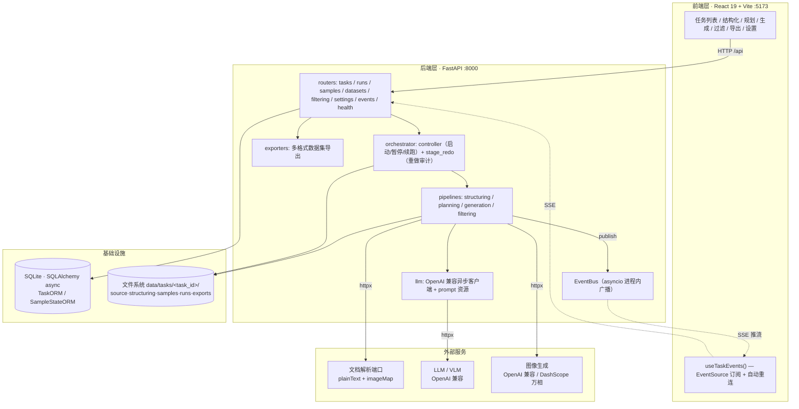
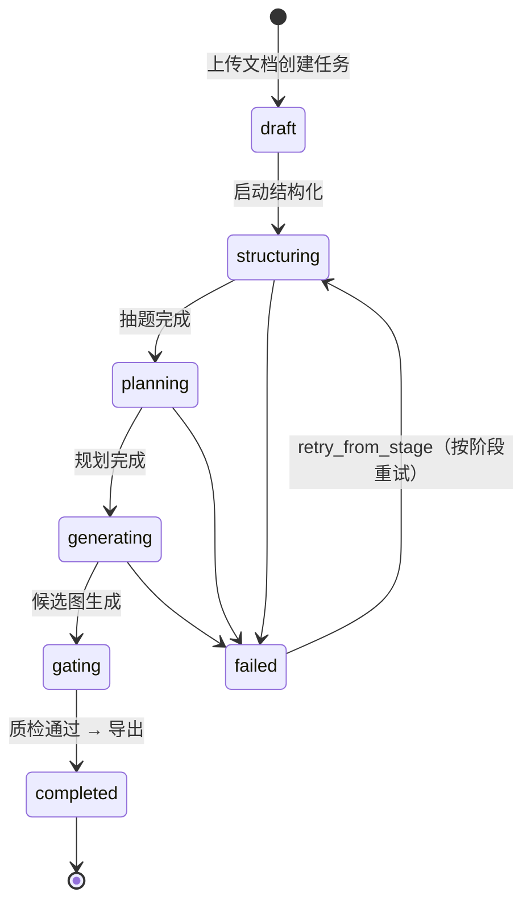
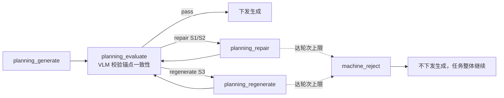
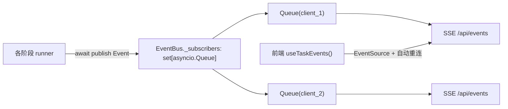

# 多模态错题图像数据集工厂 — 深度技术文档

> **mm_dataset_factory** · 一个从 Word 试卷自动产出多模态错题图像数据集的全栈 Web 平台。
> 本文是项目的完整技术档案：架构、流水线内核、数据模型、关键工程决策与难点。即使脱离源码，也能凭此文复述整个系统的设计与实现。
>
> 📸 配套截图见 `../../assets/screenshots/mm_dataset_factory/`；可视化详情页见 [index.html](index.html)（[English](index.en.html)）。

---

## 目录

1. [一句话概述](#1-一句话概述)
2. [问题背景与目标](#2-问题背景与目标)
3. [技术栈（实测版本）](#3-技术栈实测版本)
4. [系统架构](#4-系统架构)
5. [工程组织：deliverable / process / apps 三层](#5-工程组织deliverable--process--apps-三层)
6. [任务生命周期与状态机](#6-任务生命周期与状态机)
7. [生产流水线：四阶段内核详解](#7-生产流水线四阶段内核详解)
8. [L1/L2/L3 三级错误体系与评估闭环](#8-l1l2l3-三级错误体系与评估闭环)
9. [数据模型：数据库 + 文件落盘](#9-数据模型数据库--文件落盘)
10. [实时进度：asyncio 事件总线 + SSE](#10-实时进度asyncio-事件总线--sse)
11. [API 端点全集](#11-api-端点全集)
12. [关键工程决策](#12-关键工程决策)
13. [难点与解决方案](#13-难点与解决方案)
14. [安全与健壮性约束](#14-安全与健壮性约束)
15. [外部依赖与配置](#15-外部依赖与配置)
16. [本地运行与测试](#16-本地运行与测试)
17. [界面与截图导览](#17-界面与截图导览)
18. [我的贡献（待补充）](#18-我的贡献待补充)
19. [可迁移的经验总结](#19-可迁移的经验总结)

---

## 1. 一句话概述

输入一份含图的 Word 错题卷（`.doc/.docx`），经「**结构化抽题 → 错题规划(L1/L2/L3) → 改图生成 → 质检 → 导出**」一条流水线，自动产出可用于多模态模型（LMM/VLM）训练与评测的**错题图像数据集**（JSON / JSONL / XLSX / DOCX + 图片目录）。系统是一个本地 Web 操作台：FastAPI 异步后端 + React/Vite 前端，一条命令启动。

---

## 2. 问题背景与目标

**痛点。** 训练/评测多模态模型需要大量「图文不一致的错题」样本——一道含图的题，配上「这道题被改错在哪 + 对应的错误图」。人工构造这类数据：(1) 慢；(2) 难统一口径（什么算"错"、错到什么程度）；(3) 图文对齐易出错；(4) 难以规模化与追溯。

**目标。** 把这件事流水线化、可操作、可追溯、可重跑：

- 从真实试卷文档**自动抽题**，只保留含图小题，保证图文对齐。
- 为每题**系统化地规划**三个难度等级的错法，而非随机造错。
- 对需要改图的等级**调图像模型生成错误图**，并做生成后质量评估。
- 全流程**可视化、可暂停续跑、可按阶段重做**，每步产物落盘可核对。
- 最终**一键导出**成标准数据集格式。

**最终产物。** 每次导出生成 `exports/vN/` 版本目录，含 `mmdataset.{xlsx,json,jsonl,docx}` + `images/` + `images.zip` + `manifest.json`；表格同时包含**原题行**与**错误行**，便于训练与人工复核。

---

## 3. 技术栈（实测版本）

### 后端 `apps/api`

| 类别 | 选型 | 版本 | 用途 |
| --- | --- | --- | --- |
| 语言 | Python | ≥ 3.11（推荐 3.13） | 全量类型注解 + `from __future__ import annotations` |
| Web 框架 | FastAPI | ≥ 0.115 | 异步 REST API + SSE |
| ASGI | uvicorn[standard] | ≥ 0.32 | 开发/运行服务器（`--reload`） |
| 数据校验 | pydantic / pydantic-settings | 2.x | DTO 与配置 |
| ORM | SQLAlchemy（async） | ≥ 2.0.36 | 任务/样本状态索引 |
| 数据库 | SQLite（aiosqlite） | — | 轻量持久化 |
| HTTP 客户端 | httpx | ≥ 0.27 | 调外部解析端口 / LLM / 生图 |
| 文档处理 | python-docx | ≥ 1.1 | `.docx` 轻量解析回退 |
| 表格 | openpyxl | ≥ 3.1 | XLSX 导出 |
| 图像 | Pillow | ≥ 10 | 图像处理 |
| DOCX 导出 | svglib + reportlab | — | 矢量/图文转 DOCX 产物 |
| Windows 互操作 | pywin32（条件依赖） | ≥ 306 | 调 Microsoft Word 预处理 `.doc`/组合图 |
| 质量 | ruff + mypy + pytest（asyncio） | — | lint / 类型 / 测试 |

### 前端 `apps/web`

| 类别 | 选型 | 版本 |
| --- | --- | --- |
| UI 框架 | React | 19.2 |
| 构建/开发 | Vite | 8（dev server 代理 `/api`、`/static`、`/health`、`/openapi.json` → :8000） |
| 语言 | TypeScript（strict，禁 `any`） | 5.9 |
| 样式 | Tailwind CSS v4 + shadcn/ui | — |
| 数据请求 | TanStack Query | 5 |
| 路由 | react-router-dom | 7 |
| 类型同步 | openapi-typescript | 7（由后端 OpenAPI 生成 `src/api/generated.ts`） |

> 注：仓库内既有 HTML 详情页标注 "React 18 / Python 3.12"，以本表为准（实测 `package.json` 为 React 19.2，`pyproject.toml` 为 `requires-python>=3.11`）。

---

## 4. 系统架构



**几个要点：**

- **前端是纯操作台**，所有业务逻辑在后端。Vite dev server 配了代理，前端无 CORS 烦恼。
- **真相在文件系统**：任务与产物以文件形式落在 `data/tasks/<task_id>/`，任务列表权威来源是扫描该目录。SQLite 主要承担「已认领任务索引 + 样本阶段状态」，便于聚合进度，不作为唯一主存。
- **三个外部服务是平台运转前提**：文档解析端口、LLM/VLM、图像生成，均通过 `apps/api/.env` 注入配置。
- **进度通过进程内事件总线 + SSE 实时推送**，前端零轮询。

---

## 5. 工程组织：deliverable / process / apps 三层

仓库刻意做了「交付物 / 过程文档 / 工程实现」三层隔离，这是这个项目区别于普通脚手架的工程亮点：

```
mm_dataset_factory/
├── deliverable/skill/mm-dataset-factory/   # ① 对外契约（Skill-as-contract）
│   └── SKILL.md  + 子 Skill（paper-structuring / vlm-error-planning / text2image-generation）
├── process/                                # ② 过程文档
│   ├── requirements/requirements-baseline.md   # 需求与验收基线
│   ├── architecture/                            # 架构演进
│   └── plans/                                   # 切片计划（S1…S8）
├── apps/                                    # ③ 工程实现（Web 主干）
│   ├── api/   (FastAPI)
│   └── web/   (React + Vite)
└── run.py                                   # 一键启动
```

**Skill-as-contract（契约驱动）。** `SKILL.md` 不是普通 README，而是**功能交付契约**：明确定义支持的动作（`create_task` / `run_task` / `get_task` / `list_samples` / `export_dataset`）、输入字段约束、输出规范（`success` / `data` / `errors` / `meta`）、每阶段产物的路径与格式、状态机。这样：

- Web 后端与 AI Coding Agent 都**按同一份契约**对齐字段口径（阶段枚举、L1/L2/L3、样本字段），而不是各写一套语义。
- 功能可被「按契约验收」，减少凭经验猜接口行为带来的偏差。
- Web 实现**不复用** Skill 目录下的 Python 脚本，只在契约/字段/prompt 路径上对齐——实现与契约解耦。

---

## 6. 任务生命周期与状态机

`Stage` 枚举（`app/domain/enums.py`）：

```
draft → queued → structuring → planning → generating → gating → completed
                                                            ↘ failed（任意阶段异常）
（另有 batch：一键跑批的复合阶段）
```



配套的细粒度状态枚举：

- `StageRunStatus`：`idle / running / paused / done / failed`（单阶段运行态）
- `SampleStatus`：`idle / running / done / failed / machine_reject / skipped`（单样本态）
- `ErrorLevel`：`l1 / l2 / l3 / text`
- `Decision`：`pass / repair / regenerate / machine_reject`（评估闭环决策）

**可暂停续跑**：暂停后再次启动会从 `runs/latest_checkpoint.json` 的 `next_sample_no` 继续；跑批不会重新抽签。**可阶段重做**：planning / generating 支持把最近一次 run 归档到 `runs/archive/` 重来，并保留重做审计历史。

---

## 7. 生产流水线：四阶段内核详解

### ① 结构化 paper-structuring（`pipelines/structuring/`）

读取 Word 文档，以「**小题**」为粒度提取（一小题 = 一条 Sample）。核心规则：

- **仅保留含图小题**，无图小题跳过（`manifest.build_stats.total_skipped` 记真实跳过数）。
- 图片按**题内**重新编号（`img_01`、`img_02`…，不沿用整卷全局图号）。
- 题目文本保留图占位符 `<img_01>`，便于后续阶段追踪图文对应。
- 图片落盘 `structuring/images/`，文件名 `q0001_img_01.png`；表格与样本统一存**相对路径**。
- 保留 `source_file` / `question_no` 便于人工核对原文。

**输入接入有三条路径（按可用性回退）：**

1. **外部文档解析端口**（`MMDF_TEXT_EXTRACTION_URL`）：返回 `plainText` + `imageMap`，与 paper-structuring 子 Skill 协议对齐。
2. **Windows Word 预处理**（`MMDF_WORD_PREPROCESS=auto`）：检测到 Microsoft Word 时，用 pywin32 把 Word 里的**组合图 / 画布对象拍平**成普通图片，存为临时 `.docx` 再上传——解决解析端口拿不到组合图 URL 的问题。
3. **本地轻量解析回退**：`.docx` 在解析端口不可用时退回 python-docx 解析；`.doc` 不走本地回退，依赖端口。

**Sample 关键字段**：`sample_no` · `source_file` · `question_no` · `subject` · `question_type`（归一为 `选择题`/`主观题`）· `question_text`（含 `<img_XX>`）· `image_count` · `image_map`。

**产物**：`structuring/samples.jsonl`、`structuring/manifest.json`、`samples/qXXXX/base.json`、调试产物 `structuring/extraction_debug/{plain_text.txt, image_map.json, images_raw/*}`。

### ② 错误规划 vlm-error-planning（`pipelines/planning/`）

对每道含图题目调用 VLM，**每个样本固定输出 3 行**（L1 / L2 / L3），含 `error_level` 字段。详见[第 8 节](#8-l1l2l3-三级错误体系与评估闭环)。
产物：`samples/qXXXX/planning/*`、`questions_prompt_plan.{jsonl,xlsx}`、评估报告 `planning/plan_eval_report.jsonl`、调试日志 `planning_debug/qXXXX_l2.jsonl`。

### ③ 图像生成 text2image-generation（`pipelines/generation/`）

以规划产物为输入，对每条 L2/L3 调「**可上传原图的图像编辑 API**」**仅编辑目标图**（默认 `img_01`）；L1 不调生图、直接在任务图库内选图替换。

- L2/L3 的 `generated_image_map` 以原 `image_map` 为基准，只替换目标图键路径。
- 支持「一次生成 N 张」候选 + **选优**；L2/L3 候选由 **VLM 打分**辅助选择，分数/理由/模型写入 `generation/current.json.selection_meta` 与导出元数据。
- 错图落盘 `generated_images/`，映射记录 `generation/image_map_generated.jsonl`，统计与错误清单 `generation/generation_manifest.json`。

### ④ 质检 quality-gate + 导出（`pipelines/filtering/` + `exporters/`）

质检/过滤剔除不合格样本后，`exporters/dataset_exporter.py` 生成 `exports/vN/`。表头对齐样例 `mmdataset.xlsx`，同时含原题行与错误行；下载端点把整个版本目录打包为 zip。另支持**数据集合并**：多个已导出数据集按输入顺序重排 `sample_no` 并重写图片名（不去重）。

> **一键跑批（batch）**：对每题稳定随机抽 `l1/l2/l3/text` 中 3 种，结构化后自动一路跑到生成，可暂停后从 checkpoint 续跑。

---

## 8. L1/L2/L3 三级错误体系与评估闭环

这是整个项目业务价值的核心：把「造错题」从随机变成**系统化、可评估、可追溯**。

| 等级 | 含义 | 是否调图像模型 | 是否进评估闭环 |
| --- | --- | --- | --- |
| **L1 · 换图错配** | 引用其它题的图当错误图，构造图文不一致 | 否（复用已有图） | 否 |
| **L2 · 参数不匹配** | 图可改，题图参数冲突（如长度与角度矛盾） | 是（编辑目标图） | 是 |
| **L3 · 逻辑无解** | 图可改，但题图组合无解，需附 `unsolvable_reason` | 是（编辑目标图） | 是 |
| text | 只改题干文本，不动图 | 否 | 否 |

**生成后评估闭环（仅 L2/L3）：**



- 评估校验题文锚点（`numeric_anchors` / `symbolic_anchors` / `structural_anchors`）与改图动作的一致性。
- 决策分级：`S1/S2 → repair`，`S3 → regenerate`；达到 `max_repair_rounds / max_regen_rounds` 后转 `machine_reject`（机器拒绝，不转人工，但任务继续）。
- 评估报告 `plan_eval_report.jsonl` 每条至少含：`sample_no` / `error_level` / `severity` / `issues` / `decision` / `repair_actions` / `judge_trace`。

**文本补全 text_enrichment（数据一致性的关键设计）：** 当 L2/L3 计划涉及「修改图中数值」但题文缺对应数值锚点时——

1. 先执行**受控文本补全**，且补全内容**必须真正合并进该行导出的 `question_text`**；
2. 下游 `generation_prompt` **只描述改图动作**，不得把"先补题干"的过程下推给图像生成阶段口头声明；
3. 若补全后仍无法建立一致约束，判为不可执行、触发重生，不允许直接下游生成。

> 这一机制保证导出数据里「题干」与「错误图」是**自洽**的，而不是看起来对、实际锚点对不上。

---

## 9. 数据模型：数据库 + 文件落盘

### 数据库（SQLAlchemy async ORM，`app/db/models.py`）

```
TaskORM                               SampleStateORM
  task_id        PK str(80)             id          PK int autoincrement
  title          str|None               task_id     FK→tasks.task_id (CASCADE, idx)
  current_stage  str(32) =draft         sample_no   str(16) idx
  created_at     datetime(tz)           stage       str(32)
  updated_at     datetime(tz,onupdate)  status      str(32) =idle
  sample_states  → [SampleStateORM]     updated_at  datetime(tz,onupdate)
   (cascade delete)                     UNIQUE(task_id, sample_no, stage)
```

阶段进度由前端**聚合** `SampleState.status`（total / done / failed / machine_reject）得到，无需额外进度表。所有 ORM 操作走 `async with session` 异步执行。

### 文件落盘（每个任务一个目录）

```
data/tasks/<task_id>/
├── meta.json                 任务元信息（title / source_files / subject / current_stage）
├── source/                   上传的原始 .doc/.docx
├── structuring/
│   ├── samples.jsonl         一小题一行
│   ├── manifest.json         统计（total_questions/samples/skipped）
│   ├── images/               抠出的题图（相对路径引用）
│   └── extraction_debug/     plain_text.txt / image_map.json / images_raw/*
├── samples/qXXXX/
│   ├── base.json             该题基础信息
│   ├── planning/             规划产物（batch_levels.json 等）
│   └── generation/           候选与选优元数据
├── planning_debug/           qXXXX_l2.jsonl / qXXXX_l3.jsonl
├── runs/
│   ├── latest_checkpoint.json  断点（next_sample_no）
│   ├── run-<时间戳>/           每次 run
│   └── archive/                redo 归档
└── exports/vN/               导出版本（xlsx/json/jsonl/docx + images/ + images.zip + manifest.json）
```

---

## 10. 实时进度：asyncio 事件总线 + SSE

`app/core/events.py` 实现了一个**单进程订阅式事件总线**：



- `EventBus.publish(event)`：加锁取订阅者快照，逐个 `await queue.put(event)`；`subscribe()` 为每个客户端维护**独立的 `asyncio.Queue`**，迭代结束时在 `finally` 里 `discard` 自己，避免泄漏。
- `Event` 是带 `type` / `payload` / `ts`（ISO 时间戳）的 dataclass（`slots=True`）。
- SSE 路由把订阅流转成 `text/event-stream`；前端 `useTaskEvents()` Hook 用 `EventSource` 订阅、自动重连，实时刷新每题处理状态与进度数字——**整个进度展示零轮询**。

---

## 11. API 端点全集

> 以实际 routers（`app/api/routers/`）为准。

| 方法 · 路径 | 用途 |
| --- | --- |
| `GET /health` | 健康检查（返回 `llm_configured` 等） |
| `GET /api/tasks` | 任务列表（扫描 `data/tasks/` + 进度聚合） |
| `POST /api/tasks` | 新建任务（上传一个或多个 `.doc/.docx`，可带默认 subject/question_type） |
| `GET /api/tasks/{id}` | 任务详情 + artifacts |
| `DELETE /api/tasks/{id}` | 删除任务（运行中先暂停；否则 409） |
| `GET /api/tasks/{id}/structuring/state` | 读结构化 manifest + samples |
| **`POST /api/tasks/{id}/run`** | 启动某阶段，body `stage ∈ {structuring, planning, generating, batch}`；可带 `from_sample / redo_all / generation_n / concurrency / dry_run` |
| `POST /api/tasks/{id}/pause` | 暂停当前 run |
| `GET /api/tasks/{id}/runs/active` | 查活跃 run（可按 stage） |
| `POST /api/tasks/{id}/redo` | 阶段重做（仅 planning/generating，归档旧 run） |
| `GET /api/tasks/{id}/runs/stage-redo-history` | 重做审计历史 |
| `GET /api/tasks/{id}/runs/planning-debug` | 读某题某等级 planning 调试 JSONL |
| `POST /api/tasks/{id}/export` | 生成导出版本 `exports/vN/` |
| `GET /api/tasks/{id}/export/download` | 下载导出版本（zip） |
| `POST /api/datasets/merge` | 合并多个已导出数据集 |
| `GET /api/samples/...` | 样本查询 / 筛选 |
| `GET /api/settings` · `...` | 系统配置（模型选择等） |
| `GET /api/events`（SSE） | 实时事件流 |
| `GET /static/*` | 任务产物静态文件（白名单） |

> 易踩点：**`export` 不是 run 的 stage**，是独立端点；run 的 stage 只有 structuring/planning/generating/batch。

---

## 12. 关键工程决策

1. **文件系统为真相、DB 为索引。** 数据集生产是「产物为中心」的工作，落盘的 jsonl/图片/manifest 才是可交付物。任务列表扫目录、DB 只索引样本状态，避免「DB 与文件双写不一致」成为长期负担。
2. **Skill-as-contract。** 用 `SKILL.md` 把字段口径、阶段、产物路径冻结成契约，让实现可被按契约验收；Web 实现与 Skill Python 解耦，只对齐契约。
3. **进程内事件总线而非轮询/外部 MQ。** 单机操作台场景下，`asyncio.Queue` + SSE 足够且零依赖，延迟最低、运维最简单。
4. **OpenAI 兼容 + provider 自适应。** LLM/生图统一走 OpenAI 兼容协议；对 DashScope 万相这类不提供 `images/generations` 的服务，`MMDF_IMAGE_PROVIDER=auto` 时后端自动切到其原生异步生图任务接口，对上层透明。
5. **类型契约贯穿前后端。** 后端 schema → OpenAPI → `openapi-typescript` 生成前端类型；业务代码统一从 `api/types.ts` 引入别名层，杜绝前后端字段漂移。
6. **断点续跑与稳定抽签。** 跑批用稳定随机选等级 + checkpoint `next_sample_no`，暂停/重启不重抽、不重跑已完成样本。
7. **可重做 + 审计。** planning/generating 阶段重做把旧 run 归档而非删除，保留 `stage-redo-history`，过程可回溯。

---

## 13. 难点与解决方案

| 难点 | 现象 | 解决 |
| --- | --- | --- |
| **Word 组合图/画布无法解析** | 解析端口对 Word 里的组合图/画布对象返回不可下载的 URL，导致图文对不齐、`total_samples=0` | Windows 本地用 pywin32 调 Microsoft Word，把组合图**拍平**成普通图片，存临时 `.docx` 再上传（`MMDF_WORD_PREPROCESS=auto`），并在 manifest/debug 记录 warning |
| **`.doc` 旧格式** | python-docx 不支持 `.doc` | `.docx` 走本地轻量解析回退，`.doc` 依赖外部端口 + Word 预处理，失败给明确错误而非静默 |
| **改错题但题图锚点对不上** | 改图里数值，但题干没有对应数值，数据自相矛盾 | `text_enrichment` 受控补全并**真正并入 `question_text`**，补全失败则判不可执行触发重生（见第 8 节） |
| **生成质量参差** | 一次生成的错误图不一定可用 | L2/L3「生成后评估」闭环 + VLM 打分选优 + repair/regenerate 分级，达上限转 machine_reject 不卡整任务 |
| **长任务前端体验** | 几百题逐条处理，轮询既慢又抖 | EventBus + SSE 进程内推流，前端零轮询实时显示逐题进度 |
| **不同生图厂商接口不一致** | OpenAI 风格 vs DashScope 原生任务接口 | provider 自适应（`auto`），地址/模型命中万相时自动切原生异步生图 |
| **Windows 启动竞态/端口占用/中文乱码** | uvicorn `--reload` 残留 worker、5173 被占、控制台乱码 | `run.py` 统一：先按进程树释放 8000/5173，等 API 就绪再起 vite，设 `PYTHONUTF8=1` |

---

## 14. 安全与健壮性约束

- **原子写**：所有写文件走 `app/core/fs.py` 的 `atomic_write_json` / `atomic_write_bytes`，避免半截文件。
- **静态白名单**：`app/static.py` 的 `_ALLOWED_PATTERNS` 只暴露图片与候选 meta，`/static/*` 不能越权读任意文件；扩展时同步更新单测。
- **路径防穿越**：`task_id` 仅允许 `[A-Za-z0-9_-]`、长度 1~80（`app/core/ids.py`）；删除任务用 `safe_resolve` 确认目录在 `tasks_dir` 内。
- **类型严格**：TypeScript strict 全面禁 `any`；Python 全量类型注解 + `from __future__ import annotations`；ruff + mypy 把关。
- **并发控制**：`MMDF_CONCURRENCY` 控制并发；运行中任务删除返回 409，先暂停再删。

---

## 15. 外部依赖与配置

通过 `apps/api/.env` 注入（首次 `copy .env.example .env`）。关键变量：

| 服务 | 变量前缀 | 说明 |
| --- | --- | --- |
| 文档解析端口 | `MMDF_TEXT_EXTRACTION_URL`、`MMDF_IMAGE_BASE_URL`、`MMDF_API_KEY`、`MMDF_HTTP_TIMEOUT_SEC`、`MMDF_HTTP_RETRY` | 返回 `plainText`+`imageMap` |
| Word 预处理 | `MMDF_WORD_PREPROCESS`（auto/true/false） | Windows + Microsoft Word + pywin32 |
| LLM / VLM | `MMDF_LLM_BASE_URL`、`MMDF_LLM_MODEL`、`MMDF_LLM_API_KEY`、`MMDF_LLM_TIMEOUT_SEC` | OpenAI 兼容，默认 DashScope compatible-mode |
| 图像生成 | `MMDF_IMAGE_BASE_URL`、`MMDF_IMAGE_MODEL`、`MMDF_IMAGE_API_KEY`、`MMDF_IMAGE_PROVIDER`、`MMDF_T2I_*` | 未配时回退 `MMDF_LLM_*`；万相走原生异步生图 |
| 运行 | `MMDF_DATA_ROOT`、`MMDF_DB_URL`、`MMDF_CORS_ORIGINS`、`MMDF_CONCURRENCY`、`MMDF_LOG_LEVEL` | 数据根默认 `../../data` |

配置优先级：`MMDF_*` 环境变量 → 指定 JSON 配置 → `apps/api/resources/config/` 默认值。

---

## 16. 本地运行与测试

```bash
# 首次：后端环境
cd apps/api
python -m venv .venv && .venv/Scripts/activate   # Windows
pip install -e ".[dev]"
copy .env.example .env                            # 按需填密钥
# 前端依赖
cd ../web && npm install

# 一键启动（仓库根目录）：释放端口 → 起 API → 等就绪 → 起 vite
python run.py                # http://localhost:5173  /  http://127.0.0.1:8000/docs

# 冒烟 & 测试
curl http://127.0.0.1:8000/health
cd apps/api && pytest -q
```

改了后端 schema 后，必须刷新前端类型：`cd apps/web && npm run gen:api`（后端需先在跑）。

---

## 17. 界面与截图导览

截图位于 `../../assets/screenshots/mm_dataset_factory/`：

| 截图 | 对应阶段 / 说明 |
| --- | --- |
| `task_list.png` / `list.png` | 任务列表，阶段状态总览（含真实批次数据） |
| `new_task.png` | 新建任务：上传 Word、设默认学科与题型 |
| `structuring.png` | 结构化：含图题目逐条展示、图文映射 |
| `planning.png` / `planning_full.png` | 错误规划：左题目列表 + 右 L1/L2/L3 详情 |
| `generation.png` / `generation_full.png` | 生成：L1 换图 / L2·L3 AI 生成、候选选优、批跑 |
| `filtering.png` | 过滤 / 质检 |
| `export.png` | 导出：产物列表，一键生成 xlsx/json/jsonl/images.zip |

---

## 18. 我的贡献（待补充）

> ✍️ **这一节请你按实际情况填写**——这是作品集里最能体现你个人价值的部分，招聘方最关心。建议写清「你具体做了哪些模块、解决了什么问题、带来什么效果」，例如：
>
> - 我负责的模块：例如 `____ 阶段 runner` / `____ 前端页面` / `____ 评估闭环` / `____ 导出器` …
> - 我解决的关键问题：例如「Word 组合图拍平预处理，把结构化命中率从 __% 提升到 __%」「实现 L2/L3 生成后评估闭环」…
> - 量化成果：例如「处理 __ 份试卷、产出 __ 条样本数据集」「跑批支持断点续跑，单任务 __ 题」…
> - 协作与工程实践：例如「按 SKILL.md 契约对齐字段」「补充单元测试 __ 个」…
>
> 如果整套系统主要由你独立完成，可直接写「全栈独立开发」，并把第 12、13 节的决策与难点作为你的能力证据。

---

## 19. 可迁移的经验总结

这个项目沉淀下来、可写进简历/面试的能力点：

- **全栈 AI 应用工程**：FastAPI 异步后端 + React/TS 前端 + 一键启动脚本的完整闭环。
- **LLM/VLM 应用落地**：多模型供应商（OpenAI 兼容 / DashScope）适配、prompt 工程、生成后评估闭环、VLM 选优。
- **数据流水线设计**：多阶段、可暂停续跑、可重做审计、断点续跑、产物可追溯。
- **契约驱动开发**：用 `SKILL.md` 把接口/字段/产物冻结成契约，前后端类型自动同步，杜绝口径漂移。
- **实时系统**：asyncio 事件总线 + SSE 推流，零轮询进度。
- **工程素养**：原子写、静态白名单、路径防穿越、严格类型、跨平台启动竞态处理。
- **多模态数据工程领域知识**：图文对齐、错题分级体系（L1/L2/L3）、锚点一致性与文本补全。

---

*本文为项目技术档案，可独立阅读。配套可视化详情页见 [index.html](index.html) / [index.en.html](index.en.html)。*
